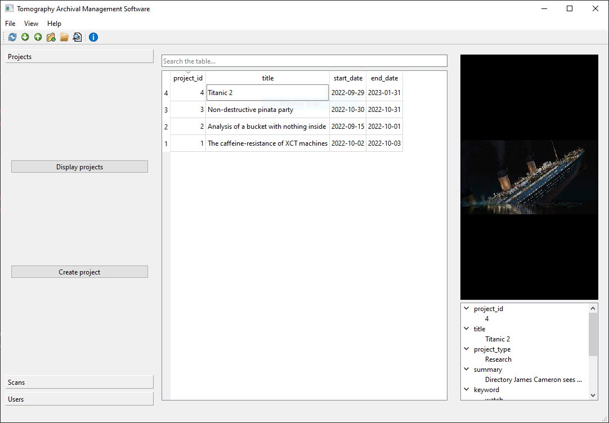

# TAMS

> Tomography Archival Management System



[](https://tams-nxct.readthedocs.io/)

TAMS is an open-source tomography archival and management application released by the [National X-ray Computed Tomography (NXCT)](https://nxct.ac.uk/), the UK's national lab-based X-ray computed tomography research facility.

It aims to make storing and accessing data easy and quick.

## Get started

TAMS is currently in alpha development and is not recommended for production use.

If you wish to use TAMS regardless, clone this repository, install the dependencies from `pyproject.toml`, and run the application.

```commandline
poetry install
poetry run python -m client
```

## Documentation

You can read the documentation [online](https://tams-nxct.readthedocs.io/).

You can also build the documentation by running the following command from the `docs/` directory:

```commandline
poetry run sphinx-build -b html source build
```

## Contribute

This project is open to contributions. Read the [contributing guidelines](https://tams-nxct.readthedocs.io/en/latest/contribute.html) for more information.

## Licence and terms

The code is released under the [MIT licence](LICENCE). The documentation is licenced under [CC BY 4.0](https://creativecommons.org/licenses/by/4.0/).

TAMS is distributed in the hope that it will be useful, but with **absolutely no warranty**. Read the [software licence](LICENCE) for more information.
